# Super Mario Bros - Proximal Policy Optimization with LSTM [PYTORCH]

## Introduction

I wrote a python code that can train an agent to play Super Mario Bros by using PPO introduced in the **[Proximal Policy Optimization Algorithms](https://arxiv.org/abs/1707.06347)**.

The environment only gives the current screen to the agent as an observation. which only reveals the location of mario and  the obstacles, but not the velocity. This means that the agent does not have complete information about the current state and it is difficult to have high performance.

To handle this problem I add an LSTM layer to the Network.  By using the LSTM layer, the agent can get the information of the past observations, which helps agent to have complete information of the current state.

Each model is trained for only one individual stage.

As a test, I tried 8 stages and confirmed that the agent can complete all 8 test stages. 

## Test results

    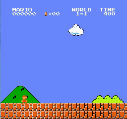
    
    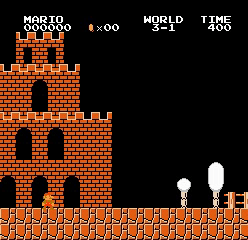
    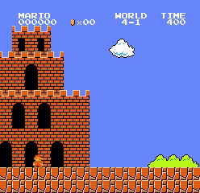 
   	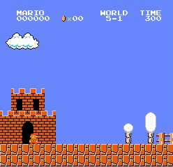
    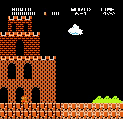
    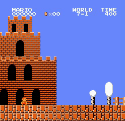
     

## Train details

At training time, If we initialize hidden states to zero, pi and pi_old will be different even under the same policy parameters. To handle this problem, I stored the initial hidden states in rollout time and used them for initialization at training time. These saved hidden states will be accurate in the first training iteration but will become less accurate as the training progresses and policy parameters changes. However, it is much more accurate than zero initialization.

All 8 test stages can be cleared by simply changing the learning rate rather than changing the network architecture or other hyperparameters.

I always started training with a learning rate of **3e-5**, and when learning stopped for a period of time, I lowered the learning rate to **3e-6**. For example, when training 2-1, The learning rate was 3e-5 up to 621000 frame, but 3e-6 was used after that.

# General Model

## Introduction 

After I tested 8 stages I tried to make a general model that can play all stages. However, no matter what learning rate I use the model was not trained at all. 

After failure, I tried a model that could clear few stages. This time, the agent cannot always clear the stage, but it was able to have some performance.

I used the same network architecture and same hyperparameters and same training code. Just modified the environment code.

## Overfitting

Before I started, I wanted to see how much the model is overfitted to the stage.

World 1-4 and 6-4 has exactly the same map. Actually, removing some obstacles from 6-4 is 1-4. 

    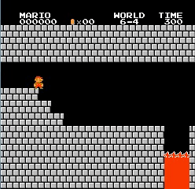
     

The above model was trained on 6-4. As you can see, even though the map of 6-4 and 1-4 are the same, and even 1-4 is easier, the agent fails 1-4 immediately after the obstacles change a little. This means that the model is strongly overfitted to the stage. 

    
     

The video above makes things more clearer. The model trained at 2-1 failed at the first Goomba of 1-1. Of course, there is a Goomba in 2-1, so the model can recognize Goomba in 1-1, but it just can't overcome it.

## Results 

First, I tried 1-4 and 6-4.  Both stages succeeded in almost reaching to the end, but failed to overcome the final boss.

    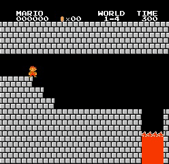
     

Next, I tried 2-3 and 7-3. This two stages is very similar. The model can complete both stages.

    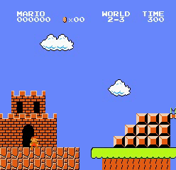
    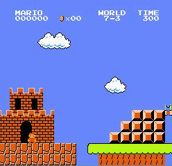 

To see if it can learn even if the background color is different, I tried stage 2-1 and 3-1. The model can complete 3-1 and have some performance in 2-1.

    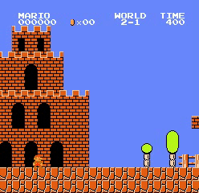
     

Next, to see if it can learn even if the way mario moves changes, I tried 1-1 and 2-2. The model can complete 1-1  but has poor performance at 2-2.

    
    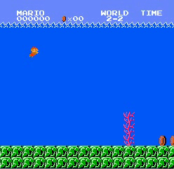 

finally, I tried 1-1, 3-1, 3-2, 5-1. The model can complete 1-1 and 5-1 and it can succeed almost to the end at 3-2. And it has some performance at 3-1

    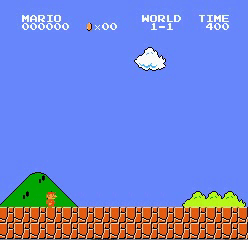
    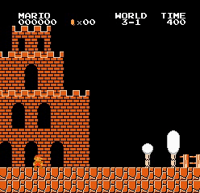
    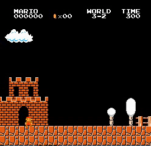
    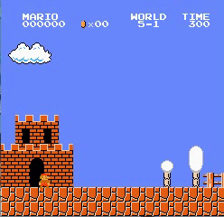 

# Modified Action

## Introduction

Until now, the form of action was to select one action from action space A . At this time, action space A is **[NOOP, right, right+A, right+B, right+A+B, A, left]** in case of SIMPLE MOVEMENT and **[NOOP, right, right+A, right+B, right+A+B, A, left, left+A, left+B, left+A+B]** in case of COMPLEX MOVEMENT (UP and DOWN have been removed for simplicity).

As you can see, the meaning of each action is a combination of 4 buttons of **right left A B**. Right now, there are only 4 buttons, so the number of actions is only 16, and in the case of COMPLEX MOVEMENT, by removing 6 meaningless actions the number of actions is 10, but if the number of buttons increases, the number of actions will increase exponentially. For example, if you only use the number buttons on the keyboard, there will be 1024 actions that are 2^10, and even if 90% of them are meaningless actions, there will be more than 100 actions. This is difficult to learn, so I tried to modify the form of the action.

## Action modification

Until now, the last layer of the policy network has as many nodes as the number of actions and shows the probability of selecting each action through the softmax function. Now, the last layer of the policy network is modifed to have as many nodes as the number of buttons and shows the probability of pressing each button through the sigmoid function.

When there are n buttons and the probability of pressing the i th button is p_i, the form of action a is as follows.

    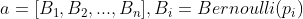

    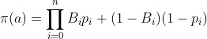

Now, action is a vector of 1 and 0, and the probability of action is a multiplication of the probability of button's current state for all buttons.

These modification can be applied immediately without modifying existing algorithms such as PPO and A3C.

## About Entropy Loss

Because the form of the action is modified, the existing entropy loss cannot be used. Therefore, entropy loss is modified as follows.

    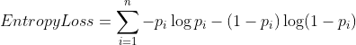

These entropy loss will be maximized when p_i is 0.5 so it will make more exploration.

However, when I actually tested. not using entropy loss was trained faster compared to using entropy loss

    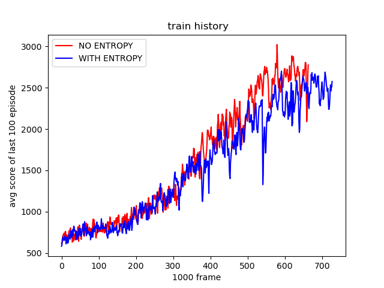 

## Results

I compared the following three cases.

- Modified action form without entropy loss
- Basic action form, removed 6 meaningless actions (COMPLEX MOVEMENT)
- Basic action form, All 16 Actions

All three models was trained in world 1-1, learning rate was always 1e-5. The network architecture is the same, but only the last layer of the policy network is different.

    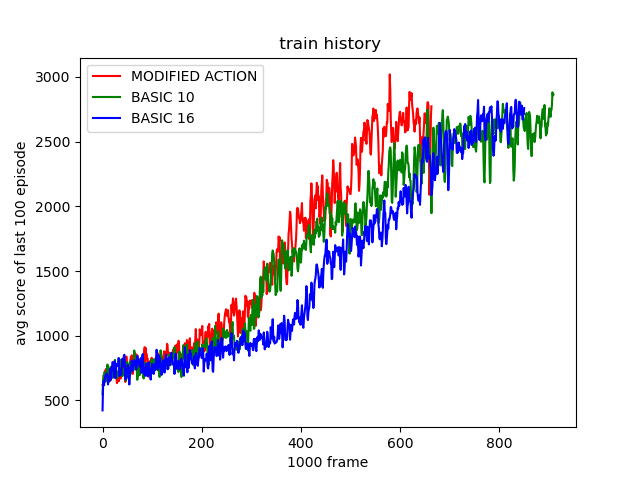
	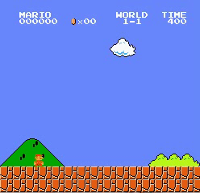 

